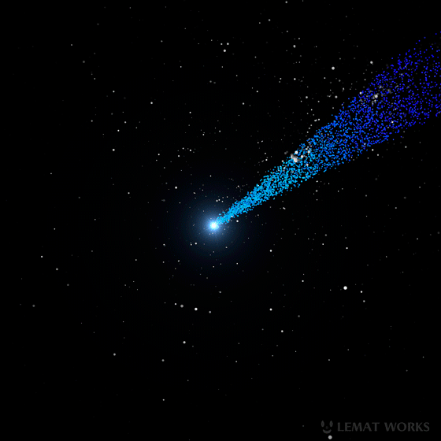

<p align="center"></p>

<h1 align="center">Cometas-API</h1>

# Api de listagem de Cometas

API REST de código aberto para dados de consulta de  pesquisa  as informações nela contida  foi desenvolvida usando como base nos dados da <a href="https://www.nasa.gov/subject/6893/nebulae/" target="_blank">NASA</a>
 e <a href="https://chandra.harvard.edu/photo/2007/orion/"></a> usando como base organizacional um sistema de CRUD
<p align="center">

## Primeiro execute o mave
```bash
 mvn package
```

## Em seguida faça compile o projeto

```
java -jar target/ApiNebulosa-API-1.0-SNAPSHOT.jar
```

# Para obter mais detalhes da documentação acesso o swagger
```
http://localhost:8080/swagger-ui.html
```
# uso

## realiza seu cadastro na api na url user
```
http://localhost:8080/api/v1/user
```
## Obtendo resultado
```
http://localhost:8080/v1/api/listAll
```

## Resultado dos dados da API
```
 [
    {
        "id": 2,
        "imagen": "https://images.educamaisbrasil.com.br/content/banco_de_imagens/guia-de-estudo/D/cometa-halley-astronomia.jpg",
        "nome": "Halley",
        "designacao": "P1",
        "coDeNome": "Cometa Halley ,P1",
        "informacaosOrbitaisDTOs": [
            {
                "id": 4,
                "excentricidade": 0.967,
                "semiEixoMaior": 17.8,
                "pontoDeHorbitaProximoDoSol": 0.586,
                "pontoDeHorbitaAfastadoDoSol": 35.1,
                "emObservacao": false
            }
        ],
        "mapaOrbitalDTOs": [
            {
                "id": 5,
                "periodoOrbital": 75.3,
                "ultimaPassagem": "09/02/1986",
                "proximaPassagem": "28/07/2061",
                "inclinacao": 162.3
            }
        ],
        "propriedadesFisicasDTOs": [
            {
                "id": 3,
                "dimensoes": "15x8km",
                "massa": "2,2x10¹⁴kg",
                "velocidadeDeEscape": "~0,002 km/s"
            }
        ]
    }
]
```


# Contribuindo
Solicitações pull são bem-vindas. Para mudanças importantes, abra um problema primeiro para discutir o que você gostaria de mudar.

Certifique-se de atualizar os testes conforme apropriado

## License
[MIT](https://choosealicense.com/licenses/mit/)
